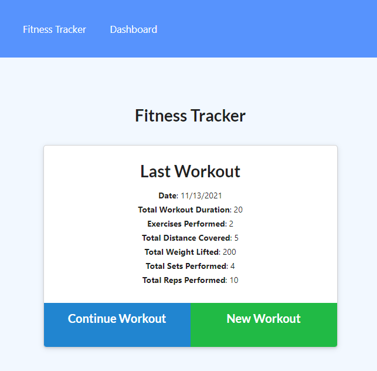

# Workout Tracker

application to track your workouts

## Table of Contents

- [Installation](#installation)

- [Usage](#usage)

- [Contributing](#contributing)

- [Tests](#tests)

- [Questions](#questions)

## Installation

copy files to your server, connect your application to a mongodb database, visit the index.html page

## Usage

Used to track your workouts

## Contributing

Bradley Kimbrell

## Tests

none

## Questions

<a href="https://github.com/brouiller">Github for brouiller</a>

<a href="mailto:bradley.kimbrell@gmail.com">Send me an email if you have any questions.</a>
